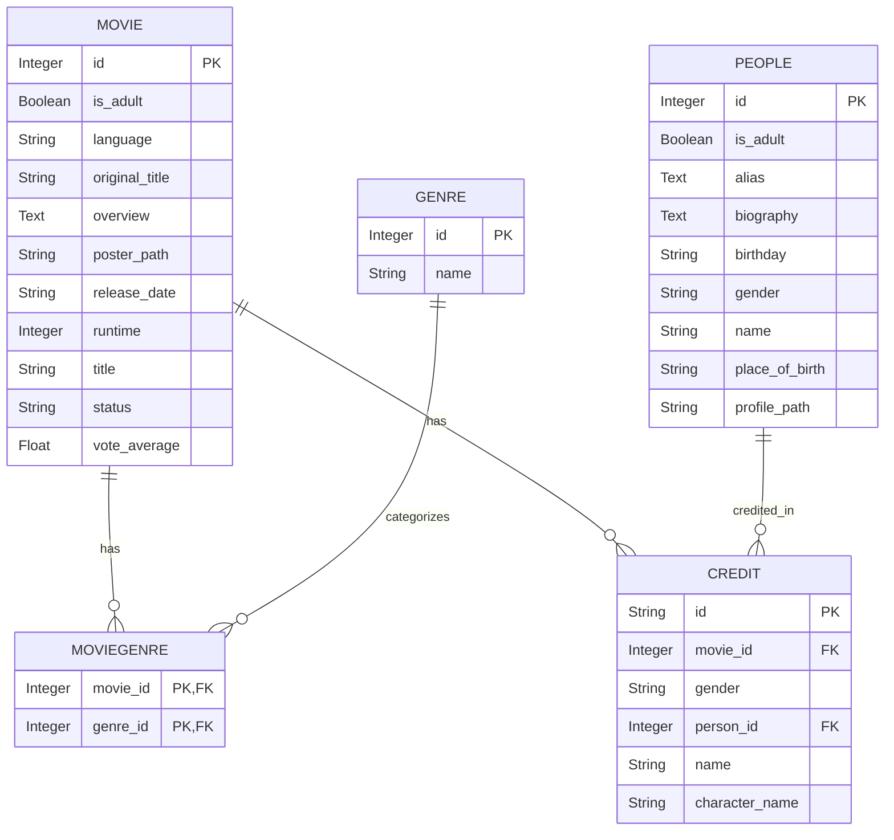

# TMDBMirror

### A high-performance backend solution featuring a robust data ingestion pipeline and FastAPI-based service for The Movie Database (TMDB). It efficiently mirrors movie metadata locally using parallel fetching, batch inserts, and SQLite storage.
---

## 🚀 Key Features

- **Multi-stage Pipeline:**  
  1. Fetch genres  
  2. Collect movie IDs  
  3. Extract detailed metadata  
  4. Fetch credits & people data
     
- **High Performance:**  
  - Parallel HTTP requests using `ThreadPoolExecutor` (50–100 workers)  
  - Batched database inserts (1,000–10,000 records per transaction) for speed and consistency

- **Robustness:**  
  - Exponential backoff and automatic retries on rate limiting and network errors  
  - Transaction-safe database operations to prevent data corruption

- **FastAPI Backend Service:**  
  - Provides a RESTful API for querying mirrored movie, genre, credit, and people data locally

---

## 🛠 Tech Stack

| Component     | Technology           |
|---------------|----------------------|
| Language      | Python 3.9+          |
| API Framework | FastAPI              |
| HTTP Client   | Requests + HTTPAdapter|
| Concurrency   | ThreadPoolExecutor   |
| Database      | SQLite via SQLAlchemy|

---

## 📦 Setup Guide

### 1️⃣ Prerequisites
- TMDB API Bearer Token ([Get one here](https://developer.themoviedb.org/docs))  
- Python 3.9 or above  
- SQLite installed (comes bundled with Python)
- Node.js (v14 or above) & npm — required to run the frontend

### 2️⃣ Installation
```bash
git clone https://github.com/shahid-alt/recsys.git
cd recsys

python -m venv venv
# Activate virtual environment:
source venv/bin/activate      # Linux/MacOS
venv\Scripts\activate         # Windows

pip install -r requirements.txt
```

### 3️⃣ Configuration
Create a `.env` file in the project root with your API key and database URL:
```ini
BEARER_TOKEN=your_tmdb_api_key_here
DB_URL=sqlite:///./data/tmdb.db
```

### 4️⃣ Create Data Directory
Ensure the directory for your SQLite database exists:
```bash
mkdir -p data
```
This ensures a consistent, predictable path for your `.db` file.

### 5️⃣ Database Migration
Initialize or upgrade the database schema using Alembic:
```bash
alembic upgrade head
```

---

## ⚙️ Pipeline Workflow

| Step | Script                  | Purpose                                  |
|-------|-------------------------|------------------------------------------|
| 1     | `fetch_genres.py`       | Populate **Genre** table with all genres |
| 2     | `fetch_movie_ids.py`    | Collect raw movie IDs into **MovieID** table |
| 3     | `fetch_movie_details.py`| Populate detailed **Movie** and **MovieGenre** data |
| 4     | `fetch_movie_credits.py`| Fetch movie credits into **Credit** table |
| 5     | `fetch_people_details.py`| Populate **People** table from credits   |

Run these sequentially for a full data mirror:
```bash
python fetch_genres.py
python fetch_movie_ids.py
python fetch_movie_details.py
python fetch_movie_credits.py
python fetch_people_details.py
```

---

## ⚡ Performance Tuning

| Script                  | Key Parameters           | Recommended Default |
|-------------------------|--------------------------|---------------------|
| `fetch_movie_ids.py`      | `max_workers`, `BATCH_SIZE` | 50 workers, 5,000 batch |
| `fetch_movie_details.py`  | `max_workers`, `BATCH_SIZE` | 60 workers, 1,000 batch |
| `fetch_people_details.py` | `max_workers`, `BATCH_SIZE` | 60 workers, 10,000 batch |

Adjust based on your machine/network for optimal throughput.

---

## 🛠 Monitoring & Troubleshooting

- **Progress Tracking:**  
  Real-time progress bars via `tqdm` with console logs for failed IDs.

- **Common Issues & Solutions:**  
  - **Rate Limiting:** Automatically retries with exponential backoff.  
  - **SSL Errors:** Retries with delay on intermittent SSL failures.  
  - **Database Constraints:** Duplicate entries are skipped gracefully.

Failed IDs are logged to console and can be reviewed post-run for reprocessing if needed.

---

## 🗄 Database Schema Overview



---

## 🚀 Running FastAPI Server

Start the API backend for querying your local TMDB mirror:
```bash
cd backend
uvicorn main:app --reload
```

---

## 🔌 API Endpoints

| Endpoint                  | Method | Description                                  | Query Parameters / Notes                                      |
|---------------------------|--------|----------------------------------------------|---------------------------------------------------------------|
| `/movies`                 | GET    | Get paginated list of movies                  | `page` (int), `limit` (int, default 20), `year`, `genre_id`, `language`, `status` filters supported |
| `/movies/search`          | GET    | Search movies by title substring              | `query` (string), `page` (int), `limit` (int)                 |
| `/movies/{movie_id}`      | GET    | Get detailed metadata of a single movie       | `movie_id` (int)                                              |
| `/movies/{movie_id}/credits` | GET | Get cast and crew credits for a movie          | `movie_id` (int)                                              |
| `/people/{person_id}`     | GET    | Get detailed information about a person       | `person_id` (int)                                             |
| `/genres`                 | GET    | Retrieve all movie genres                       | No parameters                                                |

---

### Example Requests

- **Get movies released in 2020 with genre Drama:**
  ```
  GET /movies?year=2020&genre=Drama&page=1
  ```

- **Search movies with "Matrix" in the title:**
  ```
  GET /movies/search?query=Matrix&page=1
  ```

- **Get detailed info about movie ID 603:**
  ```
  GET /movies/603
  ```

- **Get credits for movie ID 603:**
  ```
  GET /movies/603/credits
  ```

- **Get person details for person ID 287:**
  ```
  GET /people/287
  ```

---

## 🖥️ Running the Frontend (React + Vite + Tailwind)

If you want to run the frontend UI to interact with your TMDB mirror backend, follow these quick steps:

```bash
cd frontend

# Install dependencies
npm install

# Run the development server
npm run dev
```

Access the frontend at `http://localhost:5173` (or as shown in the terminal).

---

## ❓ FAQ

**Q:** How do I adjust the year range for movie collection?  
**A:** Edit `START_YEAR` and `END_YEAR` constants in `fetch_movie_ids.py`.

**Q:** Where can I find the list of failed IDs?  
**A:** Each script outputs a `failed_ids` list in the console upon completion.

**Q:** Can I use a different database like MySQL?  
**A:** Yes. Just update `DB_URL` in `.env` with your MySQL connection string.

**Q:** How do I resume a pipeline after interruption?  
**A:** All scripts skip already existing records, enabling safe reruns.

---
